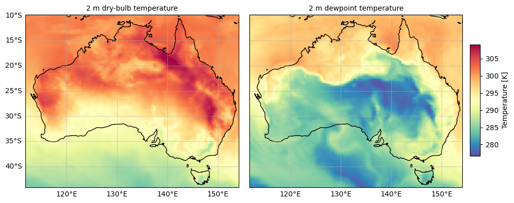
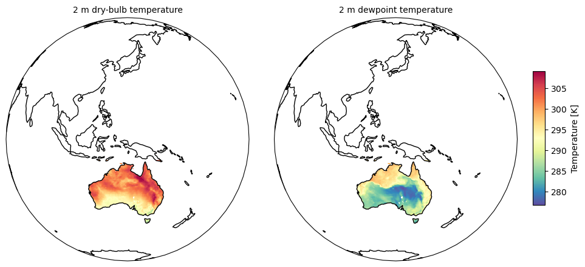

# plotmap - flexible plotting of xarray maps for publications

This module provides functions to flexibly plot maps from [xarray](https://docs.xarray.dev/en/stable/) data 
using [matplotlib](https://matplotlib.org) and [cartopy](https://cartopy.readthedocs.io/stable/).

A [demo notebook](plotmap_demo.ipynb) shows some examples of the code's use using [ERA5](https://www.ecmwf.int/en/forecasts/dataset/ecmwf-reanalysis-v5) reanalysis data.

It is simple to create plots with shared axes and scales:

And simple to adjust output projections.

By Tim Raupach <t.raupach@unsw.edu.au>.\
Released under [CC-BY-NC 4.0](LICENSE).